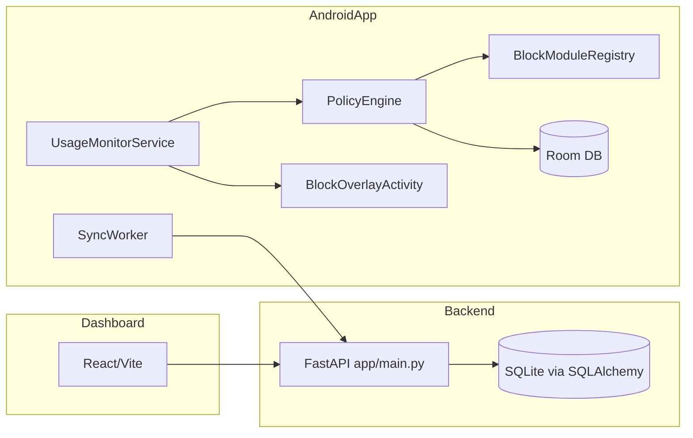

# Appbllocker — handoff (для перехода на Codex)

Дата: 2026‑07‑08  
Репозиторий: `c:\Users\vbrta\ecosentinel\Appbllocker`  
Платформы: Android (`/android`), backend (`/backend`), dashboard (`/dashboard`)

> Важно: документ составлен **только по текущему коду в репозитории** и по наблюдаемой истории изменений (видимые файлы/дифф). Где данных нет — помечено как **предположение**.

---

## 1) Что это за приложение и для кого

**Appbllocker** — Android‑приложение “always‑on” класса *app blocker / digital wellbeing*, которое:

- мониторит foreground‑приложение и дневную статистику использования;
- применяет правила блокировки (лимиты, расписания, фокус‑сессии, cooldown, блок сайтов/URL, блок Shorts/Reels);
- при необходимости показывает поверх приложения оверлей блокировки;
- имеет “админские” режимы (Device Owner / Device Admin) для усиления контроля.

**ЦА (по коду/UX‑подсказкам):**
- пользователи, которые хотят ограничить отвлечения (соцсети/short‑контент);
- “самоконтроль” + потенциальный “удалённый контроль” с ПК через синхронизацию;
- отдельные вспомогательные фичи: TODO‑лист, супер‑будильник, трекер калорий.

---

## 2) Основные реализованные функции (реально работающие в коде)

### Always‑on мониторинг + блокировка
- **Foreground‑мониторинг** в `service/UsageMonitorService.kt` (foreground service, START_STICKY).
- **Политики блокировки** через `engine/PolicyEngine.kt` и набор модулей в `engine/BlockModuleRegistry.kt`.
- **Оверлей блокировки**: `ui/BlockOverlayActivity.kt` + `ui/BlockOverlayManager.kt` (показывает причину, скрывает/показывает overlay).
- **Пароль на приложения**: `modules/apppassword/AppPasswordModule` + UI `ui/AppPasswordActivity.kt` и `ui/PasswordOverlayActivity.kt`.

### Правила (лимиты/расписание/cooldown) + управление ими
- Экран “Лимиты”: `ui/LimitsFragment.kt`
- Диалог редактирования правила: `ui/EditRuleDialog.kt`
- Типы режимов: `engine/BlockMode` (PERMANENT, TIME_LIMIT, TIME_OF_DAY, COOLDOWN) + `engine/BlockSchedule`, `engine/CooldownSettings`
- Модуль лимитов: `modules/applimit/AppLimitModule.kt`

### Группы приложений (custom group)
- CRUD групп: `ui/AddGroupActivity.kt`
- Кэш/агрегации групп: `tracker/AppGroupHelper.kt`

### Фокус‑режим
- UI: `ui/FocusActivity.kt`, `ui/FocusPickAppsActivity.kt`
- Движок: `modules/focus/FocusModule.kt`, `focus/FocusManager.kt`
- Планировщик истечения: `focus/FocusExpireScheduler.kt` + `receiver/FocusExpireReceiver.kt`
- Уведомления: `focus/FocusNotificationHelper.kt`

### Adult‑filter в браузерах (URL‑блокировка)
- `modules/adult/BrowserUrlMonitorService.kt` (AccessibilityService читает URL)
- `modules/adult/AdultContentModule.kt` (**enabled = true**) — блок по URL
- `modules/adult/UrlBlocklistStore.kt`, `modules/adult/SupportedBrowsers.kt`, `modules/adult/BrowserUrlState.kt`
- UI: `ui/AdultFilterActivity.kt`

### Блок Shorts/Reels в приложениях (In‑App feature blocking)
- `modules/inapp/InAppFeatureModule.kt` (**enabled = true**)
- Детекторы: `modules/inapp/YouTubeShortsDetector.kt`, `InstagramReelsDetector.kt`, `AccessibilityTreeScanner.kt`, сигнатуры UI (`YouTubeUiSignatures.kt`, `InstagramUiSignatures.kt`)
- UI: `ui/InAppFeatureBlockActivity.kt`

### Статистика использования
- Сбор: `tracker/UsageTracker.kt` (+ вспомогательные `tracker/UsageStatsReader.kt`, `tracker/DateKeys.kt`)
- Экран: `ui/StatsFragment.kt`, деталка: `ui/AppStatsDetailActivity.kt`
- Недельный отчёт: `ui/WeeklyReportActivity.kt`, график: `ui/stats/WeeklyUsageChartView.kt`

### Супер‑будильник
- UI: `ui/SuperAlarmActivity.kt`, `ui/SuperAlarmEditDialog.kt`, `ui/AlarmChallengeActivity.kt`
- Сервис звонка: `service/AlarmRingingService.kt`
- Модель: `data/entity/SuperAlarmEntity.kt`
- Важно: добавлено `soundDisplayName` (см. миграции БД ниже) и логика копирования звуков в приватное хранилище в `alarm/AlarmSoundHelper.kt`.

### TODO‑лист (базовый)
- UI: `ui/TodoFragment.kt` + `ui/TodoEditDialog.kt`
- БД: `data/entity/TodoEntity.kt`, DAO в `data/dao/Daos.kt`
- Примечание: по строкам (`todo_hint`) обещаны напоминания/блокировки “позже”, но это пока не реализовано.

### Трекер калорий (ручной ввод + фото)
- UI: `ui/CaloriesFragment.kt`
- БД: `data/entity/FoodEntryEntity.kt`, DAO `FoodEntryDao` в `data/dao/Daos.kt`
- Репозиторий: `calories/CalorieTrackerRepository.kt`
- Хранилище фото: `calories/FoodPhotoStorage.kt` + `res/xml/file_paths.xml` + `FileProvider` в манифесте

### Синхронизация (backend + воркер) — технически реализована
- Android‑клиент: `sync/SyncApi.kt`, `sync/SyncWorker.kt`, `sync/DeviceTokenStore.kt`
- Запуск: `AppBlockerApplication.kt` планирует `SyncWorker` каждые 15 минут + `UsageMonitorService` энкьюит one‑shot на старте.
- UI: кнопка Sync + pairing code в `ui/HomeFragment.kt`

> Примечание: синхронизация “поднимается” только если запущен backend (`/backend`) и корректно настроен `BuildConfig.API_BASE_URL` (см. `android/app/build.gradle.kts`).

---

## 3) Частично реализованные функции (есть куски, но не закончено/хрупко)

### Remote control / dashboard
- **Android‑часть**: `SyncApi` умеет `pushUsage()` и `pullPolicies()`; `DeviceTokenStore` хранит pairing code.
- **Backend**: есть минимальный FastAPI (`backend/app/main.py`) + модели (`backend/app/models.py`).
- **Dashboard**: есть минимальная React/Vite панель (`dashboard/src/App.jsx`, `api.js`).

**Что “частично”:**
- Android `SyncApi` ожидает эндпоинты вида:
  - `POST /api/v1/devices/sync/usage`
  - `GET /api/v1/devices/policies?device_token=...`
- Backend **фактически** реализует *другие* маршруты (device‑scoped по `device_id` и auth‑JWT), и это требует стыковки контрактов.
- В `DeviceTokenStore.saveRemoteDeviceId()` есть поле для remote device id, но в коде Android это поле почти не используется (по видимым файлам).

### Shorts/Reels блокировка
- Реализована, но **по определению хрупкая** (зависит от UI‑сигнатур и Accessibility).
- Долг: поддержка новых версий приложений, расширение списка приложений (TikTok и т.д.).

### Adult‑filter
- Работает для браузеров, но по своей природе ограничен:
  - инкогнито, нестандартные браузеры, WebView‑внутри‑приложений могут обходить (часть ограничений отражена в UI‑тексте — см. `strings.xml`).

### TODO
- CRUD работает, хранение `dueAtMillis` есть, но:
  - **нет напоминаний** (WorkManager/Notification);
  - **нет связи с блокировкой** (TaskGate и т.п.).

### Трекер калорий
- Есть ручной ввод + фото + сумма за день.
- Нет ИИ/распознавания по фото, дневных целей, отчётов.

---

## 4) Нереализованные, но запланированные/заложенные в архитектуру функции

> В этом разделе: (а) прямые заглушки в коде, (б) функциональность, обещанная текстами/структурой, но без реализации.

### Friend password / accountability partner (заглушка)
- `modules/friendpwd/FriendPasswordModule.kt`: `enabled = false`, `evaluate() = null`
- В `engine/BlockAction` есть `REQUIRE_FRIEND_PASSWORD`, но нет оверлея/флоу подтверждения.

### Task gate (заглушка)
- `modules/taskgate/TaskGateModule.kt`: `enabled = false`, `evaluate() = null`
- В `engine/BlockAction` есть `REQUIRE_TASK`, но нет UI/логики.

### Супер‑override / временная разблокировка (инфра без UX)
- `engine/OverrideManager.kt` (есть методы `activateSuperPasswordOverride()`, `grantTemporaryUnlock()`), но отсутствует пользовательский флоу.

### (Предположение) “Мотивации”, “план дня”, “ИИ‑калории”
- В текущем коде **нет** сущностей/экранов мотиваций или ИИ‑анализа еды.
- Эти направления обсуждались/планировались в истории разработки, но для handoff фиксируем как “планы, не реализованы” (нужен дизайн + новая функциональность).

---

## 5) Архитектура проекта (Android, backend, dashboard, БД, сервисы, sync)

### High‑level схема



### Android: основные подсистемы
- **Мониторинг**: `service/UsageMonitorService.kt`
  - читает foreground package (`UsageTracker.getForegroundPackage()`)
  - периодически обновляет usage (с throttle‑кэшем `service/TodayUsageSyncCache.kt`)
  - строит `engine/BlockContext` (usage + url + inapp feature)
  - решает `PolicyEngine.shouldBlock()` и показывает overlay
  - “sleep when screen off”: `service/MonitorScreenGate.kt` + `receiver/MonitorScreenReceiver.kt`
- **Политики**: `engine/PolicyEngine.kt` → перечисление модулей `engine/BlockModuleRegistry.kt`
- **Хранилище правил/состояний**: Room (`data/AppDatabase.kt`, `data/dao/Daos.kt`, `data/entity/*`)
- **Оверлеи**: `ui/BlockOverlayActivity.kt`, `ui/PasswordOverlayActivity.kt`, `ui/BlockOverlayTexts.kt`
- **WorkManager‑воркеры**:
  - `sync/SyncWorker.kt` (remote sync)
  - `service/MonitorWatchdogWorker.kt` (**существует по импорту**, детали не проверены в этом документе)
  - `service/WeeklyReportWorker.kt` (**существует по импорту**, детали не проверены)
- **Навигация**: `MainActivity.kt` + кастомная нижняя панель `ui/MainBottomNavigationBar.kt` (с 6 вкладками; стандартный BottomNavigationView ограничен 5).

### Backend (FastAPI)
- `backend/app/main.py`: JWT‑auth, device registration, policies CRUD, usage endpoints, emergency unlock endpoints (**видны по коду dashboard**).
- `backend/app/models.py`: SQLAlchemy модели (users, devices, policies, usage_snapshots, unlock_grants, override_events).
- `backend/app/config.py`: настройки (sqlite по умолчанию).

**Слабое место:** API контракт Android vs backend/dash не полностью совпадает (см. раздел “техдолг”).

### Dashboard (React/Vite)
- `dashboard/src/App.jsx`: login/register, список устройств, редактирование rules, просмотр usage, emergency unlock.
- `dashboard/src/api.js`: обёртка fetch c Bearer‑token; прокси на `/api` в `vite.config.js`.

---

## 6) Главные файлы и папки

### Корень
- `android/`: Android‑приложение (Kotlin, Gradle)
- `backend/`: FastAPI backend (Python)
- `dashboard/`: React dashboard (JS/React/Vite)
- `docs/`: документация (`device-owner-setup.md`)

### Android: ключевые директории
- `android/app/src/main/java/com/ecosentinel/appblocker/engine/`: PolicyEngine, блок‑модули, контекст, режимы, override
- `android/app/src/main/java/com/ecosentinel/appblocker/service/`: foreground service мониторинга и связанные сервисы/хелперы
- `android/app/src/main/java/com/ecosentinel/appblocker/modules/`: блок‑модули (limiting/focus/adult/inapp/website/…)
- `android/app/src/main/java/com/ecosentinel/appblocker/ui/`: Activities/Fragments + overlay UI + adapters
- `android/app/src/main/java/com/ecosentinel/appblocker/data/`: Room DB, миграции, DAO, entities
- `android/app/src/main/java/com/ecosentinel/appblocker/tracker/`: usage статистика + группировка (категории/группы) + date helpers
- `android/app/src/main/res/`: layouts, drawables, strings, xml configs

### Backend
- `backend/app/main.py`: все роуты
- `backend/app/models.py`: модели и `init_db()`
- `backend/requirements.txt`: зависимости

### Dashboard
- `dashboard/src/App.jsx`: UI панели
- `dashboard/src/api.js`: API helper

---

## 7) Как приложение запускается и тестируется

### Android

**Сборка debug APK:**

```powershell
cd c:\Users\vbrta\ecosentinel\Appbllocker\android
.\gradlew assembleDebug
```

**Установка на девайс/эмулятор (пример):**

```powershell
cd c:\Users\vbrta\ecosentinel\Appbllocker\android
.\gradlew installDebug
```

**Проверка монитора:**
- Открой `PermissionsActivity` и выдай необходимые разрешения (см. раздел 8).
- Убедись, что `UsageMonitorService` запущен (статус на `HomeFragment`).

### Device Owner (опционально, усиление контроля)
См. `docs/device-owner-setup.md`:

```bash
adb shell dpm set-device-owner com.ecosentinel.appblocker/.admin.AppBlockerDeviceAdminReceiver
```

### Backend

```bash
cd backend
python -m venv .venv
.venv\\Scripts\\pip install -r requirements.txt
.venv\\Scripts\\uvicorn app.main:app --reload --port 8000
```

> Примечание: по умолчанию используется SQLite (`sqlite:///./appblocker.db`).

### Dashboard

```bash
cd dashboard
npm install
npm run dev
```

По умолчанию Vite проксирует `/api` на `http://127.0.0.1:8000` (`dashboard/vite.config.js`).

---

## 8) Какие разрешения Android нужны и зачем

Источник: `android/app/src/main/AndroidManifest.xml`

- **`PACKAGE_USAGE_STATS`** (special access): чтение usage events/foreground app (ядро мониторинга).  
- **`SYSTEM_ALERT_WINDOW`**: показывать оверлей поверх других приложений (block overlay, password overlay).  
- **`FOREGROUND_SERVICE` + `FOREGROUND_SERVICE_SPECIAL_USE`**: держать `UsageMonitorService` всегда активным.  
- **`RECEIVE_BOOT_COMPLETED`**: запуск/восстановление мониторинга после перезагрузки (`BootReceiver`).  
- **`POST_NOTIFICATIONS`**: уведомления (каналы мониторинга/фокуса/weekly report).  
- **`USE_EXACT_ALARM` / `SCHEDULE_EXACT_ALARM`**: точные алармы (будильник; также возможные напоминания).  
- **`WAKE_LOCK`**: будильник/мониторинг/фоновые сценарии.  
- **`VIBRATE`**: будильник/UX.  
- **`FOREGROUND_SERVICE_MEDIA_PLAYBACK`**: `AlarmRingingService` как media playback FGS.  
- **`REQUEST_IGNORE_BATTERY_OPTIMIZATIONS`**: упрощение always‑on на агрессивных прошивках.  
- **`QUERY_ALL_PACKAGES`**: список установленных приложений для выбора/групп/статистики (требует аккуратного обоснования для Play).  
- **`INTERNET`**: синхронизация с backend + dashboard API.  
- **`CAMERA`**: фото в трекере калорий.  

Также используются **Accessibility** возможности:
- `BrowserUrlMonitorService` как `AccessibilityService` (разрешение выдаётся пользователем в настройках доступности; это не uses‑permission).

---

## 9) Известные баги, техдолг и слабые места

### API‑контракты Android ↔ backend/dashboard не синхронизированы
- Android `SyncApi.kt` использует `device_token` как query param и отдельные URL‑пути.
- Backend `main.py` ориентирован на user‑JWT и `device_id` path‑params.
- Dashboard `App.jsx` ожидает device‑scoped эндпоинты (`/devices/{id}/policies`, `/devices/{id}/usage`, `/devices/{id}/status`, `/devices/{id}/unlock`).

**Риск:** sync и remote control могут “частично” работать или не работать вовсе без приведения контрактов к единой спецификации.

### Производительность usage sync
- `UsageTracker.syncDay()` (ниже по файлу) потенциально тяжёлый: парсит `UsageEvents` и пишет daily сущности.
- Введён throttle‑кэш `TodayUsageSyncCache`, но базовая стоимость полного парсинга остаётся.

### Хрупкость Accessibility‑детекторов (Shorts/Reels, URL)
- Завязано на ID/структуру UI браузеров и соцсетей → ломается при апдейтах приложений.

### Безопасность/обходы
- Always‑allowed пакеты: в `PolicyEngine` разрешены `SystemUI`, `Settings` и само приложение — важно для “не заблокировать настройки”, но это канал обхода.
- Система “override/temporary unlock” существует, но без UX (может быть добавлено; важно не сделать обход слишком лёгким).

### Gradle/SDK warning
- compileSdk = 36 при AGP 8.2.2 даёт предупреждение (проект билдится, но стоит обновить AGP позже).

### Git line endings (CRLF/LF)
- В статусе git есть предупреждения о замене LF→CRLF на ряде файлов. Это может создавать “шумные” диффы.

---

## 10) Какие изменения сейчас есть в рабочей копии и что они добавляют

Источник: `git status` (в рабочей копии много незакоммиченных изменений).

Крупные добавления/изменения (high‑level):
- **Трекер калорий**: новые файлы в `android/app/src/main/java/com/ecosentinel/appblocker/calories/` + `ui/CaloriesFragment.kt` + layout’ы и иконки.
- **Фото еды**: `FileProvider` + `res/xml/file_paths.xml` + permission `CAMERA`.
- **БД миграции до версии 13**: добавлена таблица `food_entries` и поле `photoPath`.
- **Кастомный bottom nav на 6 вкладок**: `ui/MainBottomNavigationBar.kt` + `item_main_bottom_nav.xml` + правки `MainActivity.kt`.
- **Фикс “группа в лимитах не редактируется”**: `ui/EditRuleDialog.kt` теперь показывает состав группы и позволяет менять её приложения; вынесен общий адаптер `ui/GroupAppPickAdapter.kt`.
- **Оптимизации мониторинга**: throttle `TodayUsageSyncCache.kt`, “sleep when screen off” через `MonitorScreenGate.kt` и `MonitorScreenReceiver.kt`.
- **Фокус истечение**: `FocusExpireScheduler.kt` + receiver.
- **Super alarm звук**: `soundDisplayName` + копирование URI в приватное хранилище (устранение проблемы с потерей доступа к `content://` после гибернации).
- **Внутри‑приложения детекторы**: новые сигнатуры/детекторы (`YouTubeUiSignatures`, `InstagramUiSignatures`, `InAppPlayerDetector`).

> Важно для handoff: это всё сейчас может быть “в рабочей копии”, но не в истории коммитов (до коммита/PR).

---

## 11) Что важно не сломать при дальнейшей разработке

- **Не блокировать системные пути восстановления**: `alwaysAllowed` в `PolicyEngine` и поведение overlay должно оставлять пользователю возможность выйти из тупика (Settings/SystemUI).
- **Стабильность `UsageMonitorService`**:
  - не допустить частых тяжёлых операций в тик‑лупе;
  - сохранять корректное поведение при screen‑off (gate) и при рестарте/boot.
- **Room миграции**:
  - увеличивать версию БД строго последовательно;
  - не ломать существующие таблицы (`policy_rules`, `usage_daily`, `todo_items`, `super_alarms`, `app_groups`, `food_entries`).
- **Overlay‑логика**: показ/скрытие `BlockOverlayManager` и `PasswordOverlayManager` должен быть взаимоисключающим и не оставлять “залипаний”.
- **Sync**: прежде чем расширять remote features, привести **единый API контракт** Android↔backend↔dashboard.
- **Accessibility‑службы**: любые изменения должны уважать ограничения/политику платформы; важно не “сломать” URL extraction и детекторы short‑контента.

---

## 12) Рекомендованный следующий план разработки (после перехода на Codex)

### Шаг 0 — стабилизация ветки
- Разобрать текущие незакоммиченные изменения: сформировать 1–3 логических коммита (или PR’ы) и зафиксировать версию.
- Добавить базовый `README.md` с инструкциями запуска Android/backend/dashboard (сейчас он пустой).

### Шаг 1 — привести remote/sync к единому контракту
Цель: чтобы **Android sync**, **backend** и **dashboard** работали по одной спецификации.

Варианты:
- **Вариант A (device_token only)**: сделать backend без user‑JWT на MVP (pairing code → device_token), как ожидает Android `SyncApi`.
- **Вариант B (JWT + device_id)**: обновить Android `SyncApi` под backend (JWT‑логин, device_id, и т.д.) и хранить токены.

Рекомендация: выбрать один путь и описать OpenAPI/контракт (пути, схемы, auth).

### Шаг 2 — TODO/Day plan
- Добавить напоминания (WorkManager) и внятный UX “план на сегодня”.
- Подготовить основу для TaskGate (даже если `TaskGateModule` пока остаётся выключенным).

### Шаг 3 — ИИ‑калории (если это приоритет)
- Минимальный backend endpoint `POST /api/v1/food/analyze` (proxy к внешнему vision API).
- UI: “распознать по фото → правка → сохранить”.
- Важно: не хранить ключи API на клиенте.

### Шаг 4 — Friend password / accountability (после remote)
- Включить `FriendPasswordModule` и реализовать протокол “request/approve” через backend + dashboard.

---

## Приложение: Быстрые ссылки по коду

- Android entrypoint: `android/app/src/main/java/com/ecosentinel/appblocker/MainActivity.kt`  
- Foreground monitoring: `android/app/src/main/java/com/ecosentinel/appblocker/service/UsageMonitorService.kt`  
- Policy engine: `android/app/src/main/java/com/ecosentinel/appblocker/engine/PolicyEngine.kt`  
- Modules registry: `android/app/src/main/java/com/ecosentinel/appblocker/engine/BlockModuleRegistry.kt`  
- Room DB + migrations: `android/app/src/main/java/com/ecosentinel/appblocker/data/AppDatabase.kt`, `.../DatabaseMigrations.kt`  
- Sync (Android): `android/app/src/main/java/com/ecosentinel/appblocker/sync/SyncApi.kt`  
- Backend: `backend/app/main.py`  
- Dashboard: `dashboard/src/App.jsx`

